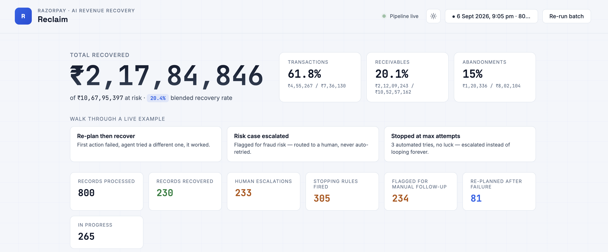
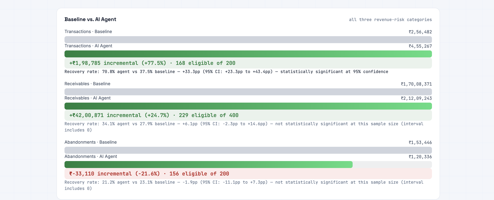
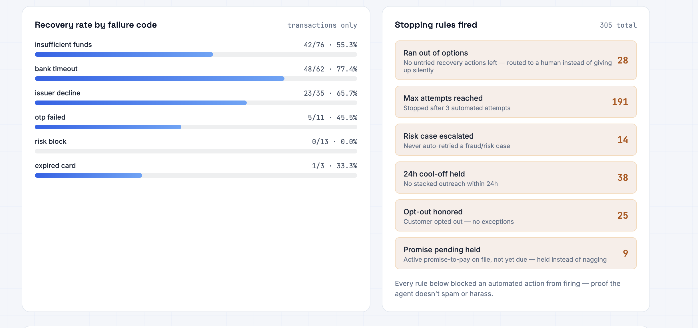
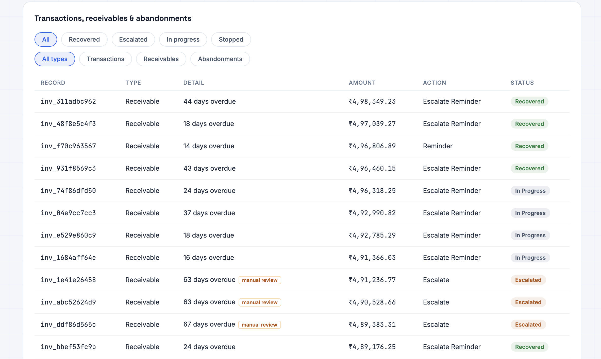
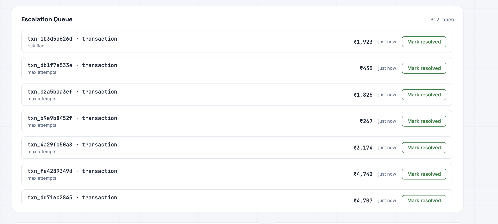

# Reclaim

An AI revenue recovery agent — built for Razorpay's **AI Revenue Recovery** buildathon track.

> We don't just identify revenue leakage. We recover it — measurably, safely, and with a complete audit trail.

## The problem

Revenue loss rarely happens in one clean step. A card expires, a bank times out, a customer's balance is short on payday, an invoice goes unpaid for 60 days, a shopper abandons their cart mid-checkout. Most of this is recoverable — *if* you diagnose why it failed and pick the right intervention instead of blindly retrying everything the same way.

## What this is

An agent pipeline that takes a batch of **failed payments**, **overdue B2B invoices**, and **abandoned checkouts** and, for each one:

1. **Diagnoses** why it failed (rules-based — deterministic, explainable, reproducible)
2. **Generates candidate recovery actions** and scores each with a trained ML model predicting `P(recovery | context, action)`
3. **Picks the action with the highest expected value** (`amount × P(success)`) among whatever a deterministic policy layer permits
4. **Executes** it against a mocked Razorpay/SMS/email layer
5. **Observes the result** — if it failed and attempts remain, it **re-plans**: tries a different action, never the same one twice, capped at 3 attempts ever
6. Logs every step to an **audit trail** explainable in plain English

Transactions (payments) are the hero feature and get the full ML + candidate-comparison + re-plan loop. Receivables and checkout abandonments are both on a simpler single-shot path — B2B reminder cadence is inherently multi-day, and abandonment recovery is a time-decay problem (odds only ever go down while waiting — no "try again in a few minutes" upside like a transient bank timeout), so neither benefits from a within-run re-plan loop.

## Architecture

```
REVENUE EVENT (failed payment / overdue invoice / abandoned checkout)
      │
      ▼
  DIAGNOSIS (rules engine — root cause, risk flag, urgency)
      │
      ▼
  CANDIDATE ACTIONS generated per failure_code / overdue tier / recency tier
      │
      ▼
  ML MODEL scores P(recovery) for each candidate
      │
      ▼
  EXPECTED VALUE = amount × P(recovery)
      │
      ▼
  POLICY / GUARDRAILS ← always checked FIRST, always wins
  (opt-out, risk flag, max 3 attempts, 24h cool-off)
      │
      ▼
  BEST PERMITTED ACTION selected and executed (mocked)
      │
      ▼
  OBSERVE RESULT
   ┌──────┴──────┐
   ▼             ▼
RECOVERED     FAILED → re-plan (transactions only) → repeat, capped
   │             │
   ▼             ▼
 STOP      STOP / ESCALATE TO HUMAN
      │
      ▼
  AUDIT TRAIL + DASHBOARD
```

**Policy always overrides the model.** A risk-flagged transaction is never auto-retried even if the model predicts a high recovery probability — the ML layer only ranks options *within* what policy has already permitted. This ordering is enforced in code (`decision.hard_policy_gate`, checked before any ML scoring happens, identically for all three record types) and is the actual compliance guarantee, not just a design intention. It has the heaviest test coverage in the project — see [Testing](#testing) below.

## The ML recovery model

`P(recovery | failure_code/tier, action, amount, attempt_count, time-of-day, day-of-week, hours_since_last_attempt, is_repeat_failure)`, a Logistic Regression trained on ~6,300 simulator-generated (context, candidate action, outcome) rows across all three record types — see `ml/generate_training_data.py`. Selected over a Random Forest after comparing ROC-AUC (0.690 vs 0.688 — close, modest, honest, not inflated).

**Calibration, not just ranking:** because the decision logic is EV-based (`amount × P(success)`), the predicted probabilities need to actually mean what they say, not just rank candidates correctly. A decile calibration table (predicted vs. actual outcome rate) is computed on the held-out test set and saved to `model_metadata.json` — visible in the dashboard, not just a metadata file nobody opens.

**Where the training labels come from, and why that matters:** this is a hackathon project with synthetic data, so "ground truth" outcomes are generated by the same mocked simulator the execution layer uses (`backend/execution.py`'s probability tables), not real payment history. The model is therefore *re-deriving known simulator parameters* through a real train/test split with no leakage, rather than discovering genuinely new signal from real-world data. That's an honest limitation, not a hidden one — see `DATA_SOURCES.md`.

**Features deliberately NOT included:** customer tenure or prior-success-rate, because every synthetic `customer_id` in this dataset is generated once and never repeats — those columns would just be constants, fake precision dressed up as personalization.

**Features added in the production-hardening pass:** `hours_since_last_attempt` (-1 sentinel if no prior attempt — captures fatigue from *how recently* a customer was last contacted, distinct from `attempt_count`'s fatigue from *how many* times) and `is_repeat_failure` (explicit categorical alongside the continuous `attempt_count`, so tree-based models can split cleanly on "any prior attempt at all"). Both are documented in `ml/generate_training_data.py`'s module docstring as genuinely informative, not constants-in-disguise.

## Candidate actions & expected value

| Category | Trigger | Candidates |
|---|---|---|
| Transaction — `bank_timeout`, `insufficient_funds` | | `RETRY_NOW`, `RETRY_LATER` |
| Transaction — `issuer_decline` | | `RETRY_NOW`, `RETRY_LATER`, `ALTERNATE_PAYMENT_METHOD` |
| Transaction — `otp_failed` | | `RETRY_NOW` |
| Transaction — `expired_card` | | `REQUEST_PAYMENT_METHOD_UPDATE` |
| Transaction — `risk_block` | | *(none — hard policy block, routed straight to a human)* |
| Receivable | `days_overdue < 15` | `SEND_REMINDER` |
| Receivable | `days_overdue >= 15` | `SEND_REMINDER`, `ESCALATE_REMINDER` |
| Abandonment | always | `SEND_CART_RECOVERY_LINK` |
| Abandonment | cart value > ₹3,000 **and** ≥1 prior attempt already failed | + `SEND_DISCOUNT_NUDGE` |

The `SEND_DISCOUNT_NUDGE` gate is a deliberate **policy** decision, not just an ML ranking — a discount is only ever offered after a plain reminder has already failed, on carts big enough to justify the margin hit, so the agent isn't discounting every abandoned cart by default.

The model correctly learned domain-appropriate rankings without being told them explicitly: `bank_timeout` (transient) prefers `RETRY_NOW`; `insufficient_funds` (balance-dependent) prefers `RETRY_LATER`, timed to a likely payday cluster.

## The bounded re-plan loop (transactions only)

```
observe → decide (ML + EV) → execute → observe result
    │
    ├─ recovered? → STOP
    └─ failed, attempts/candidates remain? → exclude the tried action,
       re-plan, execute again (repeat, hard-capped at 3 attempts ever,
       with a SAFETY_ITERATION_CAP=6 defensive upper bound that's never
       actually reached in practice)
```

This can never loop indefinitely: every iteration terminates via recovery, running out of un-tried candidates, or hitting the attempt cap. The attempt-cap and risk/opt-out/cooldown routes are enforced inside `decision.hard_policy_gate`; running out of candidates is a separate check inside `decide_transaction` itself (see the "two mechanisms" note below) — between the two, no code path leaves a transaction without a terminal decision. This termination guarantee is unit-tested with a worst-case scenario (every single attempt forced to fail) — see [Testing](#testing).

**Why receivables and abandonments stay off this loop:** B2B reminder cadence is inherently multi-day — there's no meaningful "try again in a few minutes" for an invoice. Abandonment recovery is a time-decay problem — the odds only ever go down the longer you wait, so a within-run re-plan (milliseconds after the first attempt) does nothing useful and just spends an extra customer contact. Both stay on the single-shot `decision.py`/`execution.py` path. See `decision.decide_abandonment`'s docstring for the abandonment-specific reasoning.

One real design problem worth documenting: the 24h cool-off rule (no stacked outreach on the same customer) would have accidentally strangled re-planning, since re-plan attempts happen milliseconds apart in a batch run. Fixed by only letting cool-off block *customer-facing outreach* (an SMS/email), not silent backend retries — a retry doesn't contact anyone, so it doesn't need to respect a contact cool-off.

## Policy / guardrails (the compliance floor)

Checked in this order, first match wins, before any ML scoring happens, identically for all three record types:

1. `customer_opt_out` → stop, no exceptions
2. `risk_flag` (fraud/risk cases) → escalate to human, never auto-retried
3. `attempt_count >= 3` → escalate to human, stops silent looping
4. 24h cool-off active → hold

Every gate firing is logged to `logs/revenue_recovery.jsonl` with the record ID and which rule fired — structured well enough to feed a compliance report directly from the log stream, without re-deriving anything from the DB.

**Two distinct "stopping rule" mechanisms — don't conflate them.** The four rules above all live in `hard_policy_gate` and fire *before* any candidate action is even generated, based on record-level policy state. There's a fifth, separate reason a record can end up escalated to a human: `candidates_exhausted`, which fires *inside* `decide_transaction`, *after* candidate generation, when a transaction's `failure_code` either only ever had one candidate action to begin with (e.g. `otp_failed` → only `RETRY_NOW`) or every candidate has already been tried across re-plan attempts, before the 3-attempt cap was even reached. Both are legitimate, distinct reasons for a human escalation, and both are surfaced in the dashboard's "Stopping Rules Fired" panel and counted toward "Human escalations" — an earlier version of this project had `candidates_exhausted` escalations silently missing from that panel (the escalation happened but no rule was logged for it), which meant the panel under-counted roughly 10-15% of real escalations and its "every rule below blocked an automated action" claim was false for that fraction. Fixed, and covered by `backend/tests/test_stopping_rule_coverage.py`, which asserts no `escalate_to_human` decision ever has a null `stopping_rule_fired`.

## Baseline vs. AI Agent

A fair comparison requires the baseline to sit behind the **exact same compliance floor** as the agent (`decision.hard_policy_gate`, shared code, not a re-implementation) — otherwise "baseline vs agent" is really measuring "non-compliant vs compliant," which isn't the comparison this is supposed to make. All three are scored against an identical pristine data snapshot taken before either strategy touches anything.

**Baseline strategies:** transactions — always `RETRY_NOW`, blindly. Receivables — always `SEND_REMINDER` once, no tiering. Abandonments — always `SEND_CART_RECOVERY_LINK`, no tiering, discount gate never considered.

| | Eligible N | Baseline | AI Agent | Incremental |
|---|---|---|---|---|
| **Transactions (headline)** | 168 of 200 | ₹256,482 | ₹455,267 | **+₹198,785 (+77.5%)** |
| Receivables | 229 of 400 | ₹17,008,371 | ₹21,209,243 | +₹4,200,871 (+24.7%) |
| Abandonments | 156 of 200 | ₹153,446 | ₹120,336 | −₹33,110 (−21.6%) |

*(Numbers are re-generated fresh on every `run_pipeline.py` / "Re-run batch" run — expect them to move a bit run-to-run since the underlying data is stochastic; the current codebase pins `generate_data.py`'s random seed for reproducibility, so in practice every run currently reproduces these exact figures. Verified fresh against a clean checkout on 2026-09-05 — see `BUG_SWEEP_LOG.md` pass 10; the table above previously showed stale numbers, including a positive abandonments delta that no longer matches the current pipeline's actual output.)*

**Read the abandonments row carefully: it's currently a real negative, not a rounding artifact.** The agent recovers *less* than the naive "always send the recovery link" baseline for abandonments specifically — the confidence interval (below) correctly includes zero, so this isn't statistically distinguishable from "no different than baseline" at this sample size, but the point estimate itself is negative, not just "not yet proven positive." The likely mechanism: the gated `SEND_DISCOUNT_NUDGE` policy only fires after a plain reminder has already failed once, on carts over ₹3,000 — the baseline never discounts anything, so on the subset of carts where a discount actually converts, the *agent's* recovered amount is intentionally net of that discount while the *baseline's* comparison figure isn't discount-adjusted at all, which can outweigh the recovery-rate gain at this sample size. This is disclosed here rather than smoothed over — see `Future work` for the honest fix (larger-scale evaluation to see whether this holds at scale or is sample-size noise).

Receivables' eligible-N went from ~27 to 229 after Phase 2 of the hardening pass specifically to fix this — the earlier number was disclosed as statistically underpowered, and it was.

## Audit trail

Every decision — including every attempt within a re-plan sequence — is logged with: timestamp, diagnosis, candidate actions considered with their probabilities and expected values, the action selected, which policy check passed or fired, the execution outcome, and the actor. The dashboard's "Recovery Ledger" (styled as a torn receipt) renders this as a full timeline per record, including a visible "↻ RE-PLANNED" marker between attempts.

Two separate logs exist for two separate audiences: the CLI's `print()` narration (demo-facing, human-readable) and `logs/revenue_recovery.jsonl` (structured JSON, one line per policy-gate firing / API event / error — what an operator or a compliance report generator would actually consume). They're kept deliberately separate so neither pollutes the other — see `backend/logging_config.py`.

## Dataset

100% synthetic. No production Razorpay customer or payment data was used, seen, or referenced anywhere in this project. See `DATA_SOURCES.md` for the full breakdown of what's synthetic, how it's generated, and why no public dataset was integrated.

## Evaluation methodology

- Train/test split: stratified random 80/20. A chronological split was considered but rejected as theater for this dataset — every row is an independently generated synthetic case, not a real event stream, so there's no meaningful "time" to split on. The actual leakage safeguard is feature selection: only pre-action fields are used as inputs, nothing derived from the outcome itself (`ml/train_recovery_model.py`).
- Metrics reported: ROC-AUC, PR-AUC, precision, recall, Brier score (calibration), plus a decile calibration table — see `models/model_metadata.json` after training. These numbers are kept in sync with this README by construction (both are generated from the same training run) rather than manually copy-pasted and left to drift.
- The pipeline's own internal consistency is asserted in code, not eyeballed: `recovered + escalated + still_failing + stopped_no_action == total records processed`, checked on every run, for all three categories, and covered by an automated integration test (`backend/tests/test_pipeline_invariant.py`).

## Testing

`backend/tests/` — run with `pytest backend/tests/ -v` (or `python3 backend/tests/test_*.py` directly if pytest isn't installed; every test file has a plain-Python fallback runner):

- **`test_policy_gate.py`** — the heaviest coverage in the project, since `hard_policy_gate` IS the compliance guarantee. Opt-out always wins (even combined with risk-flag/max-attempts/cooldown), risk-flag always escalates, max-attempts always escalates, cool-off blocks correctly, applies identically across all three record types, and an exhaustive test sweeps every combination of (opt_out, risk_flag, attempt_count, cooldown) to confirm the priority order can't be bypassed by any combination of inputs.
- **`test_agent_loop_termination.py`** — forces every automated attempt to fail (worst case) against a real temp SQLite DB and the real trained model, and asserts the loop always terminates at or before `SAFETY_ITERATION_CAP`, with a terminal decision (escalate or stop), never left hanging.
- **`test_pipeline_invariant.py`** — runs the full pipeline end-to-end on an isolated temp DB and asserts the consistency invariant holds for all three categories, with every record receiving some decision (none silently skipped).
- **`test_stopping_rule_coverage.py`** — regression test for the `candidates_exhausted` fix described above: asserts no `escalate_to_human` decision ever has a null `stopping_rule_fired`, and that `bucket_counts["escalated"]` always reconciles exactly with the sum of `risk_flag` + `max_attempts` + `candidates_exhausted` in `stopping_rule_breakdown` on the live project DB.
- **`test_discount_recovery_accounting.py`** — regression test for the discount-recovery accounting fix: a `send_discount_nudge` recovery must record `recovered_amount = cart_value * (1 - DISCOUNT_PCT)`, strictly less than gross `cart_value`; a non-discount recovery must record `recovered_amount == cart_value`. Confirmed to fail against the pre-fix logic.
- **`test_batch_durability.py`** — regression test for the durable-audit-trail fix: runs the full pipeline twice against one isolated DB and asserts every table's rows are additive (not replaced), the two batches are mutually untouched, and `get_current_batch_id()` resolves to the latest run. Confirmed to fail against the pre-fix `schema.init_db(reset=True)`-per-run behavior.
- **`test_promise_to_pay.py`** — unit tests for the promise-to-pay tracker: a *broken* promise makes `ESCALATE_REMINDER` eligible immediately regardless of `days_overdue` tier (confirmed to fail pre-fix); a *pending* promise is an explicit policy-level HOLD (`stop_no_action` / `stopping_rule_fired == 'promise_pending'`) checked before any candidate is even generated, so it can never be out-ranked by expected value.
- **`test_escalations.py`** — regression test for the escalation operational surface: runs the full pipeline and asserts the `escalations` table is an *exact* match against records whose latest decision is `escalate_to_human` (no more, no fewer), every escalation starts `open`, and resolving one never touches any other row.
- **`test_stats.py`** — unit tests for the Phase 5 statistics helper (`backend/stats.py`): Wilson score interval and two-proportion difference CI both checked against hand-derived reference calculations (worked out in the module's docstrings) before trusting them against real pipeline data, plus sanity properties (bounds always in [0,1], interval narrows as N grows, zero-N handled).

Runs on every push via GitHub Actions (`.github/workflows/ci.yml`): install deps, `ruff check`, train the model fresh, run the full suite.

## Production readiness

What's hardened, from the production-readiness pass on top of the original hackathon build:

- **Config**: everything a real deployment would need to change (DB path, ports, cooldown hours, max attempts, model paths, rate limits) lives in environment variables via `backend/config.py` / `.env.example` — nothing hardcoded.
- **API**: request validation (proper 4xx on malformed filters), consistent structured JSON error responses, in-memory rate limiting on `/api/run-batch`, `/api/health` for a load balancer/uptime monitor.
- **Idempotency**: a file-based run-lock (`run_pipeline.py`) prevents two pipeline runs (e.g. two concurrent `/api/run-batch` calls) from double-processing the same records — verified with an actual concurrent-subprocess test, second run correctly rejected with a 409.
- **Durable audit trail**: every pipeline run mints a `batch_id` and tags every record/diagnosis/decision/audit-log row it creates with it (`backend/migrations/0003_batch_id.sql`). A "Re-run batch" click no longer calls `schema.init_db(reset=True)` on the live DB and erases prior runs — it's additive: old batches persist untouched and stay independently queryable (`GET /api/batches`, and `?batch_id=` on `/api/summary`, `/api/records`, `/api/hero-examples`; the dashboard's batch-history dropdown drives this). `/api/baseline` is the one deliberate exception — the baseline-vs-agent comparison is recomputed fresh from a scratch snapshot each run and was never meant to be durable per-batch, so it only serves the current/latest batch and returns a clear 400 if asked for an older one, rather than silently substituting the wrong numbers. Regression-tested in `test_batch_durability.py` (two full pipeline runs against one DB; asserts row counts are additive, batches are mutually untouched, and `get_current_batch_id()` resolves to the latest run).
- **Promise-to-pay tracker**: receivables now carry a real `promise_status` (`none` / `pending` / `broken`) and `promised_pay_date` (`backend/migrations/0004_promise_to_pay.sql`), simulated for a disclosed, hand-set ~30% of 45+ day overdue invoices (see `generate_data.py::gen_receivables`). A **broken** promise is a materially worse signal than raw invoice age alone — it makes `ESCALATE_REMINDER` eligible immediately regardless of `days_overdue` tier, and forces `needs_manual_followup`/urgency, overriding the normal day-count diagnosis (`diagnosis.py::diagnose_receivable`, `candidate_actions.py::candidates_for_receivable`). A **pending** promise (not yet due) is an explicit policy-level HOLD, checked before any candidate is generated so it can never be out-ranked by expected value (`decision.py::decide_receivable`, `stopping_rule_fired == 'promise_pending'`) — same "don't stack outreach" reasoning as the existing 24h cool-off, just keyed on a customer commitment instead of a time window. Surfaced end-to-end: diagnosis text, decision reasoning, the audit-trail outcome string, `/api/records`' `detail` field (e.g. "67 days overdue · broken promise (was due 12 days ago)"), and the dashboard receipt. Unit-tested in `test_promise_to_pay.py`.
- **Escalation operational surface**: an `escalate_to_human` decision now creates an actual, actionable ticket (`escalations` table, `backend/migrations/0005_escalations.sql`) — one row per escalated record (upserted, not duplicated, on repeat escalation), with `record_id`/`record_type`/`reason`/`created_at`/`status`. Unlike most of the dashboard, this is a **durable, cross-batch worklist** by design (`GET /api/escalations`, default `status=open`, no batch scoping) — a human works the queue regardless of which run created each item. `POST /api/escalations/{id}/resolve` marks one resolved with an optional note. Surfaced in the dashboard's new Escalation Queue panel (record, reason, amount, age, one-click resolve). Regression-tested in `test_escalations.py` (exact match against every `escalate_to_human` decision, resolving one never touches another).
- **Statistical confidence on baseline-vs-agent**: the headline "+X% incremental" numbers now carry a 95% confidence interval, not just a point estimate (`backend/stats.py` — dependency-free, no `scipy`). The CI is computed on the **recovery-rate delta** (a difference of proportions — the standard normal-approximation two-proportion z-test), not the dollar-amount delta — the module's docstring documents why: a proportion difference has a simple, correct closed-form variance, while a dollar-amount delta's variance depends on the full per-record amount distribution and would need bootstrapping to do properly, not this formula. Surfaced in `/api/baseline` (`recovery_rate_delta_ci_95`, `..._significant`) and the dashboard's Baseline vs. AI Agent panel. In practice: transactions' delta (168 eligible) is statistically significant at 95% (CI excludes 0); receivables and abandonments are honestly reported as *not* significant at their current sample sizes (CI includes 0) — the same "read with caution below 100 eligible" disclosure this project already had, now backed by an actual interval instead of just a caveat sentence. Math verified in `test_stats.py` against hand-derived reference values before trusting it against real data.
- **Logging**: structured JSON audit logs to `logs/revenue_recovery.jsonl`, separate from the CLI's demo narration.
- **Testing**: see above — all three suites verified passing, including an exhaustive policy-order sweep and a forced-worst-case loop-termination test.
- **Mock/real execution boundary**: `execution.py`'s `PaymentExecutor` protocol makes the mock/real seam explicit — `MockExecutor` (the only one actually used) vs. a deliberately unimplemented `RazorpayExecutor` stub documenting exactly what a real integration would need (API key, webhook signature verification, and a note that real gateway retries are async/webhook-driven, not synchronous like the mock — a bigger refactor than swapping the class in).
- **CI/Docker**: `.github/workflows/ci.yml` (lint + full test suite on every push), `Dockerfile` + `docker-compose.yml` (`docker compose up` as an alternative to manual pip-install).

**What's still explicitly out of scope, not silently dropped:**
- The DB layer is still raw `sqlite3`, not SQLAlchemy Core. `backend/db.py` provides an engine factory and documents the Postgres connection-string swap, but the query-layer rewrite touching every `row["col"]` access across ~8 modules was judged too large/risky to attempt safely within this pass — see `db.py`'s docstring for the full reasoning. A simple versioned migration runner (`backend/migrate.py`) exists as an alternative to `init_db(reset=True)` for the current sqlite schema.
- The CI workflow and Docker setup are written and internally consistent (the exact bootstrap sequence in `docker-entrypoint.sh` was verified by hand outside Docker — see the final development summary), but were **not** executed end-to-end in a real Docker/GitHub Actions environment, since the build environment they were developed in has no Docker daemon or outbound network access. This is the one Definition-of-Done item that genuinely needs a different environment to close out.
- `RazorpayExecutor` is a stub, not a real integration — no real Razorpay API calls happen anywhere in this project. See the mock/real boundary note above.

## Dashboard

Dark navy/blue, Razorpay-adjacent. Shows: total recovered (hero number), transactions/receivables/abandonments recovery rates separately (never blended into one misleading combined figure), a three-way baseline vs. agent comparison, recovery rate by failure code, stopping-rule guardrail counts, a filterable record table (by status and by record type), and per-record audit-trail drill-down. Every panel has a loading state and a retry-on-error state — a failed API call never leaves the UI silently blank.
## Screenshots

**Overview — hero recovered number, per-category rates, live walkthrough examples**


**Baseline vs. AI Agent — the headline comparison, with 95% confidence intervals**


**Recovery rate by failure code, and every guardrail that fired**


**Full record table — filterable by status and type, with per-record audit detail**


**Escalation queue — a durable, cross-batch worklist for human follow-up**


## Demo

Click **Re-run batch** to generate a fresh batch of data and run the full pipeline live (data → diagnosis → agent loop → decision/execution for receivables + abandonments → baseline, ~10-20 seconds). Each run is **additive**, not destructive — see "Durable audit trail" below — so re-running never erases what a previous run did. Use the **batch-history dropdown** in the header to switch between any past run and inspect its numbers and audit trail independently; the dashboard defaults to showing the latest batch. Click any of the three **hero example** cards at the top for a guided walkthrough of re-planning, risk escalation, and max-attempts stopping — these are re-derived fresh from whatever the currently-viewed batch actually produced.

## Installation

**Manual:**
```bash
cd backend
pip install -r requirements.txt        # fastapi, uvicorn, scikit-learn, pandas, joblib, pydantic, python-dotenv
pip install -r requirements-dev.txt    # pytest, ruff, sqlalchemy (dev/test only)
cp ../.env.example ../.env             # optional — sane defaults work without it
python3 migrate.py                     # or, first-time-only: python3 -c "from schema import init_db; init_db(reset=True)"
python3 generate_data.py               # additive — safe to re-run; each call mints a new batch, never deletes prior ones
cd ../ml && python3 generate_training_data.py && python3 train_recovery_model.py && cd ../backend
python3 run_pipeline.py                # full batch run: data → diagnosis → agent loop → decisions → baseline
python3 -m uvicorn api:app --host 0.0.0.0 --port 8000
```
Then open `http://localhost:8000`.

**Docker (alternative):**
```bash
docker compose up
```
Bootstraps data + trains the model on first run automatically (see `docker-entrypoint.sh`), then serves the API + dashboard on `http://localhost:8000`.

## Limitations

- All data is synthetic; the ML model's outcome labels come from the same simulator used at execution time, so it's demonstrating real ML methodology (train/test split, no leakage, honest metrics, calibration checking) rather than discovering genuinely new signal from real-world payment behavior.
- No public dataset (e.g. a UPI transactions dataset) was integrated — the sandboxed build environment's network access didn't extend to Kaggle or similar sources, and rather than force a dataset in under that constraint, the existing synthetic generator was kept as the sole data source. See `DATA_SOURCES.md`.
- The re-plan loop is scoped to transactions only; receivables and abandonments remain on a single-shot decision path, by design (see above), not as an unaddressed gap.
- The DB layer, CI, and Docker setup have the scope caveats described in **Production readiness** above — read that section before assuming this is fully verified end-to-end in a live CI/Docker environment.
- Receivables' and abandonments' sample sizes (400 and 200 generated records respectively) are far better-powered than the original ~50/~27-eligible receivables-only build, but are still smaller than a real production batch — the dashboard and README both report eligible-N alongside every comparison rather than asserting confidence the sample size doesn't support.

## Scope vs. the track brief

The track brief names seven example directions. This project builds four of them in depth rather than attempting a shallow pass at all seven:

**Built:**
- **Payment degradation → root cause → recovery action** — `diagnosis.py` classifies by `failure_code` (insufficient funds, expired card, bank timeout, OTP failure, risk block, issuer decline), each routed to a distinct recovery path.
- **Checkout drop-off recovery** — cart abandonment diagnosis, recency-tiered outreach, and a gated discount nudge with correctly net-of-discount recovered-amount accounting.
- **B2B receivables chaser** — day-count-tiered reminder escalation.
- **Promise-to-pay tracker** — not a bolt-on: `promised_pay_date`/`promise_status` (`none`/`pending`/`broken`) are real fields that change diagnosis, candidate-action eligibility, and decision-making — a broken promise escalates immediately regardless of day-count tier, a pending one is an explicit policy-level hold. See `generate_data.py::gen_receivables`, `diagnosis.py::diagnose_receivable`, `candidate_actions.py::candidates_for_receivable`, and `decision.py::decide_receivable`.

**Not built:**
- **Failed-subscription recovery** and **mandate retry sequencer** — both need a genuinely different data shape (a billing-cycle concept, a mandate ID, a subscription state machine) that doesn't reuse the transaction/receivable/abandonment model this project is built around. Retrofitting that shape in would mean building a fourth parallel record type with its own diagnosis/decision/execution path from scratch, not extending an existing one — judged out of scope for depth-over-breadth reasons, not overlooked.
- **Hinglish voice recovery** — a different modality entirely (speech input/output, code-mixed language understanding), with no existing infrastructure here to extend. This project's entire recovery loop is text/API-driven; voice would be a separate system bolted alongside it, not a feature added to it.

Depth-over-breadth was the deliberate tradeoff: the four built directions get a real ML-ranked decision engine, a bounded re-plan loop with tested stopping rules, a durable cross-batch audit trail, an actionable escalation queue, and a statistically-honest baseline comparison — rather than five directions each getting a shallow, unverified pass.

## Future work

- Public UPI transaction dataset for more realistic amount/timing distributions, if network access allows
- Extend the bounded re-plan loop to receivables with a multi-day-aware scheduler
- Subscription/mandate recovery — see "Scope vs. the track brief" above for why this wasn't attempted this round; it would need a new billing-cycle/mandate-ID data model, not just a new decision path on the existing one
- A real `RazorpayExecutor` implementation, including the async/webhook-driven retry flow a real gateway integration actually needs (see Production readiness)
- The SQLAlchemy query-layer migration described in Production readiness
- Larger-scale batch evaluation (thousands of records) for tighter confidence intervals across all three categories
